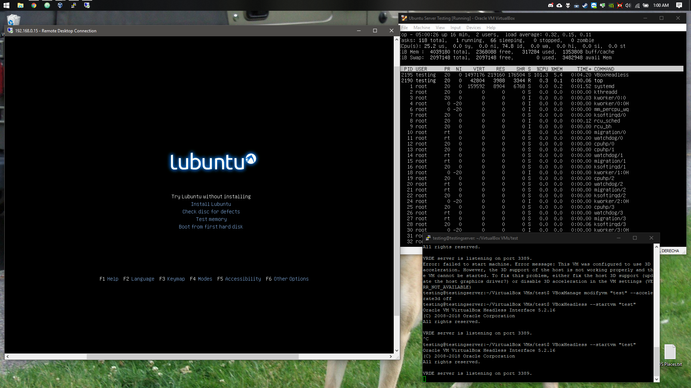

# Packages and Programs
This is a list that contains a number of useful packages, programs and overall, services that work on a headless installation.

## Screen
**Screen** is a wonderful tool capable of improving multitasking on a single shell window with the ability to *background* processes. It also lets you recover shell windows when there's a connection loss.

### Installation

    sudo apt-get install screen

### Usage
At first it may seem a little complicated and maybe even intimidating to use this tool but once you get used to it you'll realize how useful it really is.

First start up **screen**, type:

    screen

Here's a table with the keys and actions you can do with **screen**:

| Keys         | Action                    |
|--------------|---------------------------|
| `Ctrl-a` `c` | Creates a new window.     |
| `Ctrl-a` `n` | Switches between windows. |
| `Ctrl-a` `d` | Detaches from screen.     |
| `Ctrl-a` `n` | Switches between screens. |

To reattach to a *screen*:

    screen -r <screen pid>

## Others
These are other packages which may be required by the services that run on the machine.

    sudo apt-get install lib32gcc1 ranger firefox thunar unzip wget

> **Note**: **lib32gcc1** is required by **SteamCMD** to be able to properly run certain game servers on a 64-bit architecture.

## UFW
**ufw** is a friendly frontend for **iptables** that makes it a lot easier to add connection rules to your firewall. One of the many wonders of **ufw** is the ability to add connection rules by specifying service names rather than ports (we'll see this when set up the firewall rules for the next services). We'll need to install **ufw** it and set it up.

    sudo apt-get install ufw
    sudo ufw default allow outgoing
    sudo ufw default deny incoming
    sudo ufw enable

The commands should be pretty self explanatory but, just in case, these default the firewall to allow any connection going from the server to the internet and deny any incoming connections from the internet to the server.

A very good command to check **ufw**'s status (if it's enabled or disabled) and see all the custom rules added and active is:

    sudo ufw status

## SSH
Since the server will run in headless mode, it would be very useful to be able to access it remotely from within (and even outside) the network. We'll use **OpenSSH**, it is generally installed with the OS but in case that it isn't, you can install it by running:

    sudo apt-get install openssh-client openssh-server

We now need to allow SSH connections through the firewall so we can access the server.

    sudo ufw allow ssh

## VirtualBox
VirtualBox is a machine virtualization software which has the option to run in a headless mode (pretty useful in this case), which directs all display and controls through an RDP connection. Not only can we run some VM's to run certain services that may need a dedicated environment we can also "portabilize" these servers, making it easier to back them up in case something goes wrong.

In this case we'll use a VM to manage our router in a graphical environment without the need to install a DE or WM on the server (since we want it to remain headless). This VM doesn't require to run 24/7 and ends up being pretty useful considering the *only* alternative would be to forward **X11** through **SSH** which is unstable and literally unusable in high latency connections.

### Installation
Firstly we need to install some initial packages and reboot the server.

    sudo apt install build-essential dkms
    sudo reboot

We now need to add the VirtualBox source to our *apt* sources and refresh them.

    sudo echo "deb http://download.virtualbox.org/virtualbox/debian bionic contrib" >> /etc/apt/sources.list
    sudo apt-get update

Right before the installation we need to install Oracle's public key.

    wget -q https://www.virtualbox.org/download/oracle_vbox_2016.asc -O- | sudo apt-key add -

We're ready to install VirtualBox.

    sudo apt-get install virtualbox-5.2

Before creating/running our VM's we'll need to add our user to the *vboxusers* user group. (Replace $USER with your username.)

    sudo adduser $USER vboxusers

We're not there yet, we still need to install the extension that will let VirtualBox run a VRDP server so we can use the VM remotely through an RDP connection. [Download the latest VirtualBox Extension Pack from Oracle's official site](https://www.virtualbox.org/wiki/Downloads). Copy the link, download through *wget* and install. (Keep in mind the example below may not show the correct link.)

    wget https://download.virtualbox.org/virtualbox/5.2.16/Oracle_VM_VirtualBox_Extension_Pack-5.2.16.vbox-extpack
    sudo VBoxManage extpack install Oracle_VM_VirtualBox_Extension_Pack-5.2.16.vbox-extpack

### Creating a VM
Creating a VM is done through a series of commands, the process can be a little long to write so keep an eye of what you're about to input in your terminal window. As an example we'll install [Lubuntu 18.04 64-bit](https://lubuntu.net/downloads/). Download the *iso* and keep it somewhere (for example in **~/Downloads** ).

Before we begin, we need to see what is our network interface, they're usually called *eth0 enp0s3 wlan0* etc, depending on how many interfaces the server has or interface type. To see your interface name type in console:

    ifconfig

You should receive an output similar to this one:

    enp0s3: flags=4163<UP,BROADCAST,RUNNING,MULTICAST>  mtu 1500
            inet 192.168.0.15  netmask 255.255.255.0  broadcast 192.168.0.255
            inet6 ::a00:27ff:fe49:8561  prefixlen 64  scopeid 0x0<global>
            inet6 fe80::a00:27ff:fe49:8561  prefixlen 64  scopeid 0x20<link>
            ether 08:00:27:49:85:61  txqueuelen 1000  (Ethernet)
            RX packets 755025  bytes 1132393073 (1.1 GB)
            RX errors 0  dropped 0  overruns 0  frame 0
            TX packets 94785  bytes 9330879 (9.3 MB)
            TX errors 0  dropped 0 overruns 0  carrier 0  collisions 0

In our case *enp0s3* is the name of our interface, **it may be different for you**.

Now we begin. Feel free to change whatever to accommodate your needs.

    VBoxManage createvm --name "Lubuntu" --register
    VBoxManage modifyvm "Lubuntu" --memory 2048 --acpi on --boot1 dvd --nic1 nat --vram 128 --cpus 2
    VBoxManage createhd --filename ~/VHDD/Lubuntu.vdi --size 10000
    VBoxManage storagectl "Lubuntu" --name "IDE Controller" --add ide
    VBoxManage storageattach "Lubuntu" --storagectl "IDE Controller" --port 0 --device 0 --type hdd --medium ~/VHDD/Lubuntu.vdi
    VBoxManage storageattach "Lubuntu" --storagectl "IDE Controller" --port 1 --device 0 --type dvddrive --medium ~/Downloads/lubuntu-18.04-desktop-amd64.iso
    VBoxManage modifyvm "Lubuntu" --vrde on

That's it, the VM is ready to be used, but before we go ahead and run it, we need to add some firewall rules so we can access the **VRDP** server.

    sudo ufw allow 3389/tcp

### Running the VM
You can start your Headless VM with the following (keep in mind to replace with your own VM name):

    VBoxHeadless --startvm "Lubuntu"

To control your VM connect to your server's IP through a RDP client. (Remote Desktop on Windows for example.)

Should you need to power off, reset, suspend your VM, use the following:

    VBoxManage controlvm "Lubuntu" poweroff
    VBoxManage controlvm "Lubuntu" pause
    VBoxManage controlvm "Lubuntu" reset

Here's a little example of how the VM runs in **RDP** (Yes, it's a VM running under a VM.)


## TeamSpeak 3
With the existence of Discord, it seems like TeamSpeak 3 is loosing it's popularity but for the sake of the server's utility, we'll still make a TeamSpeak 3 server.

Firstly we need to make a new user.

    sudo adduser --disabled-login teamspeak

We now download the [newest version of TeamSpeak 3 Server](https://www.teamspeak.com/en/downloads#server) and we extract it.

    cd ~/Downloads
    wget http://dl.4players.de/ts/releases/3.3.0/teamspeak3-server_linux_amd64-3.3.0.tar.bz2
    tar xvf teamspeak3-server_linux_amd64-3.3.0.tar.bz2

We now need to transfer the content of the folder we extracted to the home directory of the user *teamspeak*.

    cd teamspeak3-server_linux_amd64
    sudo mv * /home/teamspeak
    cd .. && rm -rf teamspeak3*

Before starting the server we need to accept TeamSpeak 3's license agreement.

    sudo touch /home/teamspeak/.ts3server_license_accepted

We then need change the ownership of the files in the *teamspeak*'s home directory.

    sudo chown -R teamspeak:teamspeak /home/teamspeak

Now, we need to make a *systemctl* service so the server can run as a service and autostart with the server. Create the daemon with:

    sudo nano /lib/systemd/system/teamspeak.service

And in the text editor, paste the following and save.

    [Unit]
    Description=TeamSpeak 3 Server
    After=network.target

    [Service]
    WorkingDirectory=/home/teamspeak/
    User=teamspeak
    Group=teamspeak
    Type=forking
    ExecStart=/home/teamspeak/ts3server_startscript.sh start inifile=ts3server.ini
    ExecStop=/home/teamspeak/ts3server_startscript.sh stop
    PIDFile=/home/teamspeak/ts3server.pid
    RestartSec=15
    Restart=always

    [Install]
    WantedBy=multi-user.target

We can now reload *systemctl* and start the service. (Type your password when necessary.)

    systemctl --system daemon-reload
    systemctl enable teamspeak.service
    systemctl start teamspeak.service

The server is now up and running but before we continue, we need to set up some things.

We need to make a password for the *teamspeak* user and change user to *teamspeak*.

    sudo passwd teamspeak
    su teamspeak

Now we can get our server's privilege key so we can turn ourselves as the server admin.

    cat /home/teamspeak/logs/ts3server_*

You'll receive an output similar to this one:

    --------------------------------------------------------
    ServerAdmin privilege key created, please use the line below
    token=****************************************
    --------------------------------------------------------

Lastly, let's not forget to add firewall rules to accept TeamSpeak 3 connections.

    sudo ufw allow 9987/udp
    sudo ufw allow 30033/tcp
    sudo ufw allow 10011/tcp

Finally, once you connect to your server, you'll be prompted to add the privilege key, enter it to become server admin and change any server configuration from within your client.

## NO-IP DUC
NO-IP DUC is a client that updates the public IP of your server to a NO-IP host. This is particularly useful if you want to have a free hostname instead of having to use your IP directly or if your public IP is not static (which is the case of most people). For this you obviously need a NO-IP account, you can create one [here](https://www.noip.com/sign-up).

To install this just follow this chain of commands:

    cd /usr/local/src/
    sudo wget http://www.no-ip.com/client/linux/noip-duc-linux.tar.gz
    sudo tar xf noip-duc-linux.tar.gz
    cd noip-2.1.9-1/
    sudo make install
    cd .. && sudo rm -rf noip*

This last command will ask for your login and password for the NO-IP site, it'll then ask you which of your hosts you want to update and in which interval.

We finally need to create a *systemctl* service so it can autostart on system boot. We make the service file with:

    sudo nano /etc/systemd/system/noip2.service

Add the following text to the editor and save the file.

    [Unit]
    Description=No-IP Dynamic DNS Update Client
    After=network.target

    [Service]
    Type=forking
    ExecStart=/usr/local/bin/noip2

    [Install]
    WantedBy=multi-user.target
    ```
    Lastly, to enable the service:
    ```
    systemctl daemon-reload
    systemctl enable noip2.service
    systemctl start noip2.service

## OpenVPN
This section of the guide will be a little long so I'm separating this by different parts.

### Installation
We'll install two packages and make a folder.

    sudo apt-get install openvpn easy-rsa
    make-cadir ~/openvpn-ca
    cd ~/openvpn-ca

### Setting Up and Building Certificate Authority
We'll change the certificate authority variables.

    nano vars

Change the following information according to your needs, I recommend you leaving *KEY_NAME* as *"server"*.

    export KEY_COUNTRY="US"
    export KEY_PROVINCE="CA"
    export KEY_CITY="SanFrancisco"
    export KEY_ORG="Fort-Funston"
    export KEY_EMAIL="me@myhost.mydomain"
    export KEY_OU="MyOrganizationalUnit"
    export KEY_NAME="server"

We source the variables now and clean our environment.

    source vars
    ./clean-all
    ln -s openssl-1.0.0.cnf openssl.cnf

We can now build our certificate authority (hit enter for everything, leave any challenge password blank).

    ./build-ca

### Building Server Certificate, Key and Encryption.
We now need to generate our server and Diffie-Hellman keys and our HMAC signature (leave blank when asked for challenge password).

    ./build-key-server server BLANK PASS
    ./build-dh
    openvpn --genkey --secret keys/ta.key

### Configuring the VPN Server
We'll transfer the server keys and certificates generated previously to `/etc/openvpn`.

    sudo cp ca.crt server.crt server.key ta.key dh2048.pem /etc/openvpn

Now we'll create a server configuration file, you can look up for server configurations, base yourself from the default one or just copy my own. If you want to base yourself from the default one, run:

    gunzip -c /usr/share/doc/openvpn/examples/sample-config-files/server.conf.gz | sudo tee /etc/openvpn/server.conf

Since I already know what settings I'm going to need for the VPN server, I'll directly create the server configuration.

    sudo nano /etc/openvpn/server.conf

My own configuration goes as follows:

    local 0.0.0.0
    port 1194
    proto udp
    dev tun
    ca ca.crt
    cert server.crt
    key server.key
    dh dh2048.pem

    server 10.8.0.0 255.255.255.0
    ifconfig-pool-persist ipp.txt
    keepalive 10 60
    cipher AES-256-CBC
    comp-lzo
    max-clients 20
    persist-key
    persist-tun
    status openvpn-status.log
    verb 3
    client-to-client

    tls-auth ta.key
    key-direction 0
    auth SHA256

    user nobody
    group nogroup

### Allow IP Forwarding
In order for the server to forward inbound VPN connections to the main network interface the server uses, we'll need to set up IP forwarding. Access the following file:

    sudo nano /etc/sysctl.conf

Uncomment the following line:

    net.ipv4.ip_forward=1

To see if changes were made:

    sudo sysctl -p

Now, we need to know what is our main network interface, you can use:

    ifconfig

You'll receive a similar output:

    enp0s3: flags=4163<UP,BROADCAST,RUNNING,MULTICAST>  mtu 1500
            inet 192.168.0.15  netmask 255.255.255.0  broadcast 192.168.0.255
            inet6 ::a00:27ff:fe49:8561  prefixlen 64  scopeid 0x0<global>
            inet6 fe80::a00:27ff:fe49:8561  prefixlen 64  scopeid 0x20<link>
            ether 08:00:27:49:85:61  txqueuelen 1000  (Ethernet)
            RX packets 755025  bytes 1132393073 (1.1 GB)
            RX errors 0  dropped 0  overruns 0  frame 0
            TX packets 94785  bytes 9330879 (9.3 MB)
            TX errors 0  dropped 0 overruns 0  carrier 0  collisions 0

The first word that comes out, that is your network interface, save it for later because we'll need it. Edit the UFW rules from the config file:

    sudo nano /etc/ufw/before.rules

Inside this document you'll see the following:

    #
    # rules.before
    #
    # Rules that should be run before the ufw command line added rules. Custom
    # rules should be added to one of these chains:
    #   ufw-before-input
    #   ufw-before-output
    #   ufw-before-forward
    #

Just after these lines we'll add the following:

    # START OPENVPN RULES
    # NAT table rules
    *nat
    :POSTROUTING ACCEPT [0:0]
    # Allow traffic from OpenVPN client to enp0s3 (change to the interface you discovered!)
    -A POSTROUTING -s 10.8.0.0/8 -o enp0s3 -j MASQUERADE
    COMMIT
    # END OPENVPN RULES

We also need to change UFW's configuration.

    sudo nano /etc/default/ufw

Here we'll replace `DEFAULT_FORWARD_POLICY="DROP"` to `DEFAULT_FORWARD_POLICY="ACCEPT"` and save the file.

Now to add the firewall rules to enable connections to the VPN and allow any connection through the VPN:

    sudo ufw allow 1194/udp
    sudo ufw allow in on tun0
    sudo ufw allow out on tun0

### Starting the Server
The server is ready to start (make sure to replace server with whatever server name you used when creating the server keys):

    sudo systemctl start openvpn@server

If there was no issues you'll be able to see a new interface called `tun0` when using `ifconfig`. If that isn't the case then most likely your server configuration is causing issues.

To enable the service so the server autostarts on login:

    sudo systemctl enable openvpn@server

### Creating a Client Base Configuration
The server isn't ready yet, we still need to create client keys, certificates and profiles. To make this job a lot easier we'll create a base configuration which is going to server as the base for all clients generated and we'll create a client generating script. For the base configuration we'll create some folders and the base configuration itself.

    mkdir -p ~/client-configs/files
    chmod 700 ~/client-configs/files
    cp /usr/share/doc/openvpn/examples/sample-config-files/client.conf ~/client-configs/base.conf
    nano ~/client-configs/base.conf

In the text editor you'll see that a configuration is already there, we'll need to make some changes in there to suit our needs.

  * Firstly, look for `remote server_IP_address 1194` and change `server_IP_address` to your server's external IP address, you can add your numerical IP address (xxx.xxx.xxx.xxx) only if it's static, if that's not your case I recommend you checking out the following: [NO-IP DUC](#no-ip-duc).
  * We'll not uncomment the following items: `user nobody`, `group nogroup` and `comp-lzo`.
  * Now we need to comment the following items: `ca ca.crt`, `cert client.crt` and `key client.key`.
  * We need to add the following: `cipher AES-256-CBC`, `auth SHA256` and `key-direction 1`.

Save and quit the file.

### Client Generating Script
Create a script in the `~/client-configs` folder:

    nano ~/client-configs/make_config.sh

Paste the following in the text editor:

    #!/bin/bash

    # First argument: Client identifier

    KEY_DIR=~/openvpn-ca/keys
    OUTPUT_DIR=~/client-configs/files
    BASE_CONFIG=~/client-configs/base.conf

    cat ${BASE_CONFIG} \
        <(echo -e '<ca>') \
        ${KEY_DIR}/ca.crt \
        <(echo -e '</ca>\n<cert>') \
        ${KEY_DIR}/${1}.crt \
        <(echo -e '</cert>\n<key>') \
        ${KEY_DIR}/${1}.key \
        <(echo -e '</key>\n<tls-auth>') \
        ${KEY_DIR}/ta.key \
        <(echo -e '</tls-auth>') \
        > ${OUTPUT_DIR}/${1}.ovpn

To make the following script executable:

    chmod 700 ~/client-configs/make_config.sh

### Creating Keys, Certificates and Profiles for Clients
You'll need to repeat this process for every client that will use the VPN, client profiles are not interchangeable, meaning that each client needs to use it's own generated profile and set of keys, trying to use a single profile for multiple devices will result in issues when connecting to the VPN. We'll go to the `~/openvpn-ca` folder where all our keys are saved and source our variables.

    cd ~/openvpn-ca
    source vars

For every client, run the following, make sure to change **$CLIENT** with the client name and remember to set a blank challenge password:

    ./build-key $CLIENT

Once we've generated all the client keys and certificates we need, we'll go back to the folder where our script is located and run it for every client we made.

    cd ~/client-configs
    ./make_config.sh $CLIENT

Our client profiles will be saved in the `./files` folder.

### Connecting to the VPN
To connect to the VPN your client device will need [OpenVPN](https://openvpn.net/) installed, you can find it for almost any platform. You'll need to transfer from the server to the client device their respective profile: `~/client-configs/files/$CLIENT.ovpn` and the **ta.key** file `~/openvpn-ca/keys/ta.key` (this should be only required in mobile clients but chances are your desktop client may need it as well). When connecting to the VPN, the client will receive it's own virtual private IP (10.8.0.x), the server's IP is generally (10.8.0.1). You can now establish connections to the server that are not port forwarded by the router (Samba/CIFS for example).

## Squid (HTTP Proxy)
Squid is an easy to set up HTTP proxy with the ability to do web-caching, meaning that if multiple people connect to the proxy and they try to download the same file, the process will be sped up for the second client downloading because the file will be stored in the server's cache. An HTTP proxy is useful when you need to access IP whitelisted applications from other locations without the need to use a VPN.

Anyways, to install Squid:

    sudo apt-get install squid apache2-utils

We'll install *apache2-utils* to generate users so we can limit the proxy connections by user authentication.

To set up said Squid's users:

    sudo touch /etc/squid/squid_passwd
    sudo chown proxy /etc/squid/squid_passwd
    sudo htpasswd /etc/squid/squid_passwd $USER

> Change $USER with the username you want to create, you'll be then asked to enter a password. Keep in mind you can create as many users as you need.

We can now edit Squid's configuration:

    sudo nano /etc/squid/squid.conf

First we'll change the port that Squid will listen to (we like 1337/TCP for this). Look for and replace the following:

    http_port 1337

Now we'll tell Squid to add the user authentication parameters we need. Find the following, uncomment these parameters and edit them if needed.

    auth_param basic program /usr/lib/squid/basic_ncsa_auth /etc/squid/squid_passwd
    acl ncsa_users proxy_auth REQUIRED
    auth_param basic real Squid proxy-caching web server
    auth_param basic credentialsttl 12 hours

Before finishing, we'll tell Squid to allow connections for authenticated users. Look for `http_access deny all` and above that line add the following:

    http_access allow ncsa_users

Now we'll create a new firewall rule to allow connections to the *1337/TCP* port.

    sudo ufw allow 1337/tcp

We can now restart Squid.

    sudo service squid restart

We're now ready to use our HTTP proxy, in your internet browser you can add your IP and the port you used to the proxy settings, if you try to connect with no authentication you'll get an error when browsing, you'll need to login with your user.

## Plex
Plex is an amazing tool that lets you run a media server on your computer. You can add your own music, movies, TV series or even pictures and stream them from an Internet browser or a mobile device (with the Plex app). This is pretty useful for all of us who keep a collection of movies or TV series DVD's and want them in a single place. The best feature this program has is the ability to share your library with your friends.

Unlike the other programs, this one installs in a pretty easy way. First head over to the [Plex downloads site](https://www.plex.tv/media-server-downloads/#plex-media-server) and download the latest release for your operating system.

    wget https://downloads.plex.tv/plex-media-server/1.13.5.5291-6fa5e50a8/plexmediaserver_1.13.5.5291-6fa5e50a8_amd64.deb

Now we proceed with the installation:

    sudo dpkg -i plexmediaserver_1.13.5.5291-6fa5e50a8_amd64.deb
    sudo systemctl enable plexmediaserver.service
    sudo systemctl start plexmediaserver.service

Just like the other programs, we need to add a firewall rule.

    sudo ufw allow 32400/tcp

We can now access the web interface via `http://serverip:32400/web` to set up the server and link it to our Plex account.

### Adding Multiple Hard Drives
Maybe your media collection is so big that you cannot fit it in one single drive, you insert a second hard drive to your computer, you plug in your USB hard drive only to find out that when trying to add it to your Plex library you get bombarded with errors. This issue happens when there's some problems with the permissions system and the *plex* user.

In order to fix this issue we'll need to change some settings with the *plex* user, enter the following commands (replace $USER with your actual username):

    sudo gpasswd -a plex plugdev
    sudo gpasswd -a plex root
    sudo gpasswd -a plex sudo
    sudo gpasswd -a plex $USER
    sudo gpasswd -a $USER plex

Now we'll add our hard drives to the mount points that we'll create so they get mounted and recognized by Plex on startup. In our case we'll add an internal (SATA) drive and an external (USB) drive.

    mkdir ~/plex_sata ~/plex_usb

I'll assume your drives are already partitioned and formatted. We can list the drives with:

    sudo blkid

You'll receive an output similar to this one:

    /dev/sda2: UUID="f5a613fe-981a-11e8-937c-080027498561" TYPE="ext4" PARTUUID="544fba45-03a8-4b4f-a199-26f6b1b1d94b"
    /dev/loop0: TYPE="squashfs"
    /dev/sda1: PARTUUID="46e94feb-2ed3-4b1f-b21f-41d452fe2b13"

> Notice here that there's only one hard drive plugged in so it only recognizes /dev/sda, this is called the ID. If you have a drive plugged in and it does not show up in this list, it is likely not partitioned or formatted. Do not proceed if this happens. Instead use fstab to fix your issues and then come back.

Identify the drive ID that corresponds with what you need to add to Plex, copy the UUID that is displayed, we'll need it later. We need to edit our file system table.

 **PROCEED AT YOUR OWN RISK, MESSING UP THIS FILE WILL MOST PROBABLY BREAK YOUR COMPUTER!**

 Access the *fstab* file:

    sudo nano /etc/fstab

We now need to add the following in a new line (separate everything with a `Tab`).

    UUID=$UUID  $DIR	$FORMAT	0	0

If you replace everything with your information you should get something like this.

    UUID=A82CC6B45D20  /home/server/plex_usb	ntfs	0	0

Finally, reboot your server. You can now add your external hard drive in the Plex library by adding the folder you added as a mount point.

## Samba (SMB/CIFS)
Samba lets your Linux based server share files and folders on a Windows File Sharing Workgroup using the same protocol (SMB/CIFS), this is pretty useful when you need to share files between computers on your network and can even be accessed through the Internet (although it should only be done through a VPN for security purposes).

To install Samba:

    sudo apt-get install samba

We'll make a folder on our *home* directory, this will serve as the share folder which will be accessible through *SMB*.

    cd ~ && mkdir sambashare

We now need to add this folder entry to the configuration. Open up Samba's config file.

    sudo nano /etc/samba/smb.conf

Now we'll add the folder we created alongside other directories to the Samba share (note that you should replace these directories corresponding to your needs). You can add as many entries as you need as long as they're well formatted.

    [sambashare]
        comment = Samba shared folder
        path = /home/$USER/sambashare
        read only = no
        browsable = yes

    [home-users]
        comment = Home users folder
        path = /home
        read only = no
        browsable = yes

Now we restart the Samba service to apply the changes:

    sudo service smbd restart

Before trying to access the share with another computer, we'll need to add a password to the Samba user. Use the next command and replace **$USER** with your username.

    sudo smbpasswd -a $USER

Now, as a final step, add the firewall rule to allow *SMB* connections.

    sudo ufw allow 445/tcp

## Transmission
Transmission is a torrent downloader that has the option to run in a CLI daemon, perfect for our little headless server.

In order to install this we need to make an user to better organize our storage and set up a password so we can log in as this new user.

    sudo adduser --disabled-login transmission
    sudo passwd transmission

Since the new user does not have anything in its *home* folder, we'll make the Downloads folder and set up its permissions so the *transmission* user can access it and write on it.

    sudo usermod -a -G debian-transmission transmission
    sudo chgrp debian-transmission /home/transmission/Downloads
    sudo chmod 770 /home/transmission/Downloads

Now, to download Transmission, we'll need to add a PPA source, update the sources and directly install.

    sudo add-apt-repository ppa:transmissionbt/ppa && sudo apt-get update
    sudo apt-get install transmission-cli transmission-common transmission-daemon

Now to configure it we need to stop the Transmission service and edit the config file.

    sudo systemctl stop transmission-daemon.service
    sudo nano /var/lib/transmission-daemon/info/settings.json

In this file, we'll edit just the next lines:

    "rpc-enabled": true,
    "rpc-password": "password here",
    "rpc-username": "user login",
    "rpc-whitelist-enabled": false,
    "download-dir": "/home/transmission/Downloads",
    "incomplete-dir": "/home/transmission/Downloads",
    "umask": 2,

> As a little explanation, *rpc-password* can be set as whatever you want, once the file saves your password will be encrypted, so no worries about storing your password in plain text. The *rpc-username* can be set as whatever you want, it doesn't have anything to do with your server username, this will be used to login to Transmission on a remote session, same goes for *rpc-password*.

We need to add a firewall rule.

    sudo ufw allow 9091/tcp

So we can now start the Transmission service.

    sudo systemctl start transmission-daemon.service

### Connecting to your Transmission Session
There are lots of ways to connect to Transmission, my two favorite ones are: [*Transmission Remote GUI*](https://github.com/transmission-remote-gui/transgui/releases) and *Transmission Web GUI*, the latter begin the one already included with Transmission. With the first one you can access Transmission as if it was a regular Torrent client on your PC, with Transmission Web, you can access it through a web browser by accessing `http://serverip:9091`, login with your credentials and you're ready to go.